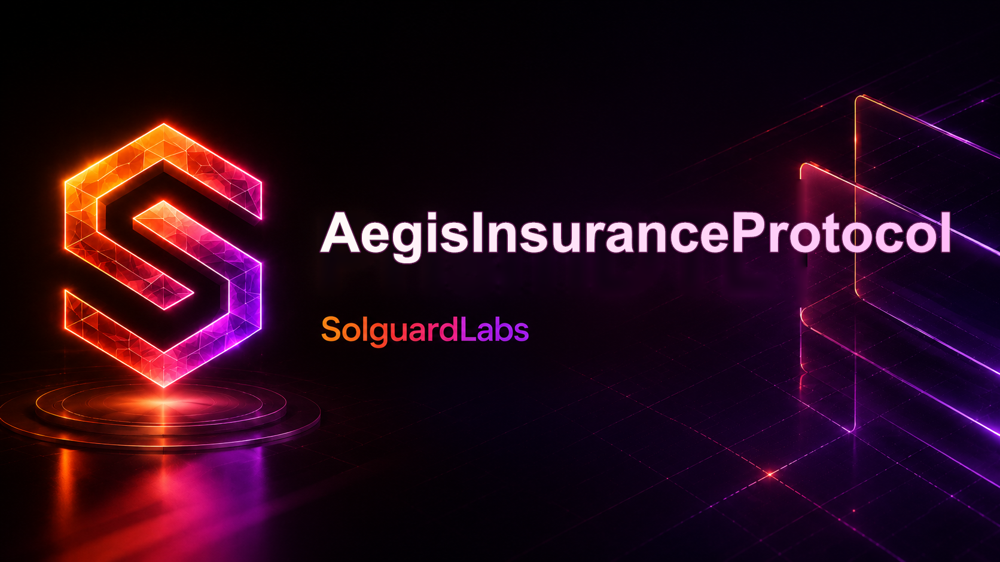

# AegisInsuranceProtocol



AegisInsuranceProtocol es un mercado de seguros DeFi escrito en Vyper, con pruebas Python
ejecutadas sobre una cadena local de Boa. El sistema permite a underwriters aportar capital,
configurar productos de cobertura, emitir polizas, transferir exposicion entre pools
especializados, presentar claims, aprobar pagos y retirar capital no comprometido.

> Estado del proyecto: software experimental. No usar con fondos reales sin revision
> independiente, parametros operativos propios y controles adicionales.

## Componentes

| Componente | Responsabilidad |
| --- | --- |
| `src/AegisInsuranceProtocol.vy` | Contrato principal de pools, polizas, cesiones, claims y retiradas. |
| `src/aegis_protocol/pricing.py` | Motor off-chain de primas, scores y observaciones de riesgo. |
| `src/aegis_protocol/ledger.py` | Ledger operativo para escenarios, asignaciones y snapshots locales. |
| `src/aegis_protocol/claims.py` | Reglas de revision de claims, evidencias y recomendaciones. |
| `src/aegis_protocol/reporting.py` | Reportes CSV/Markdown de exposicion y solvencia. |
| `src/aegis_protocol/scenarios.py` | Escenarios deterministas para pruebas y demos internas. |

## Flujos Principales

1. Un sponsor crea un pool de riesgo con limites de utilizacion.
2. Underwriters depositan capital y reciben shares internas.
3. Gobernanza configura productos de cobertura.
4. Un usuario compra una poliza y paga la prima.
5. El pool bloquea capacidad por la cobertura emitida.
6. Un router puede ceder parte de la exposicion a otro pool activo.
7. Un keeper registra incidentes admitidos.
8. El beneficiario presenta un claim con evidencia.
9. Revisores aprueban o rechazan el claim.
10. Un keeper liquida el payout aprobado.
11. Las polizas vencidas liberan capacidad.
12. Underwriters retiran capital libre.

## Requisitos

- Python 3.13.
- Vyper 0.4.3.
- titanoboa 0.2.8.
- pytest 8.4.2.

## Instalacion

```bash
python -m venv .venv
source .venv/bin/activate
python -m pip install -e ".[dev]"
```

En Windows PowerShell:

```powershell
python -m venv .venv
.venv\Scripts\Activate.ps1
python -m pip install -e ".[dev]"
```

## Uso

```bash
# Compilar contrato Vyper
python -m vyper -f abi src/AegisInsuranceProtocol.vy

# Ejecutar pruebas
bash scripts/tests.sh

# Validacion completa
bash scripts/ci.sh

# Control de lineas fuente
bash scripts/check-loc.sh
```

En Windows:

```powershell
powershell -ExecutionPolicy Bypass -File scripts/tests.ps1
powershell -ExecutionPolicy Bypass -File scripts/ci.ps1
```

## Estructura

```text
.
|-- src/
|   |-- AegisInsuranceProtocol.vy
|   `-- aegis_protocol/
|       |-- claims.py
|       |-- constants.py
|       |-- ledger.py
|       |-- models.py
|       |-- pricing.py
|       |-- reporting.py
|       `-- scenarios.py
|-- tests/
|-- scripts/
|-- .github/
|-- .vscode/
|-- pyproject.toml
|-- README.md
`-- SECURITY.md
```

## Desarrollo Seguro

Los cambios que afecten a capital, exposicion, primas, vencimientos, claims o retiradas deben
incluir pruebas de conservacion de saldos y pruebas con polizas sindicadas entre pools. Las
incidencias y reportes de seguridad deben seguir el proceso descrito en [SECURITY.md](SECURITY.md).

## Licencia

MIT. Consulte [LICENSE](LICENSE).
